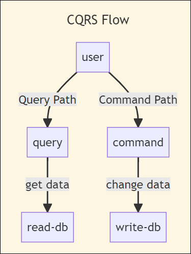

**CQRS** - Command Query Responsibility Segregation - is a design pattern used in software architecture to address the complexity and performance issues that can arise in systems handling both read (**query**) and write (**command**) operations. CQRS suggests segregating the data models and operations for reads and writes into separate components, optimizing each for its specific use case.

In a traditional monolithic architecture, the same data model and database schema are often used for both reading and writing data. However, as an application grows in complexity, the read and write patterns might have different requirements and performance characteristics. CQRS helps to tackle this by decoupling the data storage and retrieval mechanisms. 

## How CQRS Works

These are some key features of CQRS and how it works.

### Separation of Models

Instead of using a single data model for both reading and writing, CQRS recommends having separate models. The command model is optimized for handling write operations, ensuring data consistency and integrity. The query model is designed for efficient data retrieval and is optimized for read operations.

### Command and Query Paths

The application's code is divided into two distinct paths: the Command Path and the Query Path. The Command Path handles write operations, such as creating, updating, or deleting data. The Query Path handles read operations and is optimized for querying and displaying data to users.

### Optimized Data Stores

The Query Model often uses specialized data stores optimized for querying, such as read-only databases, caching mechanisms, or search indexes. These data stores are designed to efficiently retrieve and present data to users. Because write operations are asynchronous and use separate models, it's not unusual for data in the query store to lag behind for recent updates, unless specific measure are taken to address this behavior. Often the approach that is taken is to let the user know changes may take some time to appear, combined with implementing the user's change in the local app even if the query store doesn't yet reflect it. For example, after a user has added a comment to a conversation, the comment appears in their local browser/app even if it hasn't yet been handled by the command processor on the server (and thus isn't visible to anyone else).

### Asynchronous Benefits

While CQRS doesn't inherently require an asynchronous approach, it often pairs well with asynchronous communication to achieve better scalability, responsiveness, and separation of concerns. Asynchronous communication can help in scenarios where write operations need to be processed independently from read operations, and where eventual consistency is acceptable.

Consider this example with social media.

1. The user posts a message on their profile. When this happens, the API sends a command to create a new post.
2. The command is validated and then handled. This is when the data changes are made. Once the data changes are made, an event is triggered and sent to a queue or a bus for further processing.
3. The user wants to look up details for their profile. The UI makes a call to an API with a query.
4. The query returns the data with the profile details.
5. The event to update the read database comes in and synchronizes the database.
6. Eventually, the profile details indicate there is an update and the page needs refreshed to see the new message.

The nature of the reads and writes separated means that the reads are not necessarily blocked by writes. There is an eventual consistency that means that the read database will be in sync with the write database eventually, not necessarily immediately in sync.

## Common Patterns with CQRS

CQRS is also seen with other patterns, including Event Sourcing and Materialized Views.

### Event Sourcing

Event Sourcing is often combined with CQRS, though it's certainly not a prerequisite for using CQRS in your application. Event Sourcing is used to capture all changes to the application state as a sequence of events. These events represent the transitions in the system's data. By replaying these events, you can reconstruct the state of the system at any point in time. This approach provides a reliable audit trail and can facilitate debugging and troubleshooting.

### Materialized Views

Materialized Views are also seen with CQRS, as read-only sources for the **queries** of CQRS. Materialized views are read-only aggregates of data that are structured in a way to allow for efficient querying of data. These can be used to improve response times of queries, as materialized views are built to have the data optimized for queries.

## Conclusion

CQRS can bring several benefits, including improved performance, scalability, and maintainability of complex systems. However, it also introduces additional complexity and may not be suitable for all projects. Implementing CQRS requires careful consideration of the application's requirements and trade-offs.

It's important to note that while CQRS is a powerful pattern, it's not a one-size-fits-all solution. It's recommended to assess whether the complexity introduced by CQRS is justified by the specific needs of your application.

## References

- [Azure Architecture: CQRS](https://learn.microsoft.com/en-us/azure/architecture/patterns/cqrs)
- [Introducing CQRS (Ardalis)](https://ardalis.com/command-query-responsibility-separation/)
- [CQRS (Martin Fowler)](https://martinfowler.com/bliki/CQRS.html)
- [AWS Prescriptive Guidance: CQRS](https://docs.aws.amazon.com/prescriptive-guidance/latest/modernization-data-persistence/cqrs-pattern.html)