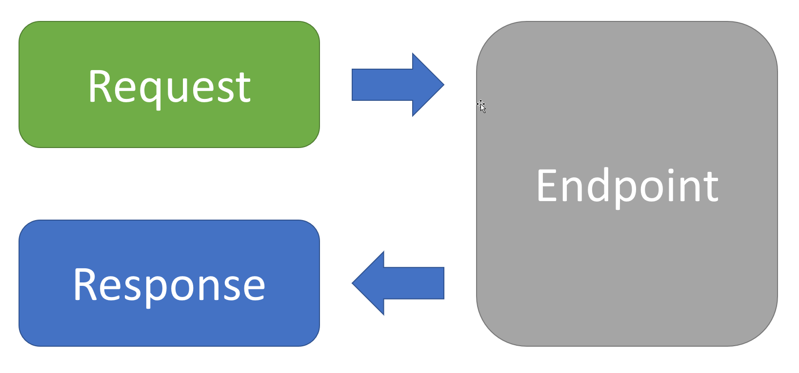

The **REPR Design Pattern** defines web API endpoints as having three components: a Request, an Endpoint, and a Response. It simplifies the frequently-used MVC pattern and is more focused on API development.

The classic MVC pattern (Model, View, Controller) has been around for decades and has been used for UI apps successfully for a long time. But even with non-API ASP.NET apps, it's not a perfect fit, since frequently you see things like ViewModels added into the mix, which of course the pattern doesn't mention (and the MVVM pattern is just over there laughing at all of this...). If you use ASP.NET and MVC and ViewModels are you really using MVVMC? It starts to look like rather large Roman numeral (though unlike Arabic/decimal numerals, not all combinations of Roman numerals are valid, and actually MVC and MVVMC are both invalid).

But what about APIs? Does it even make sense to have ViewModels for APIs? No, not really. Some kind of DTO (Data Transfer Object), sure, but certainly not a ViewModel, given that there's no View. (if we don't have Views or ViewModels does that just leave us with MC Architecture? Some long lost 80s rap artist?)

Typically I would refer to these as ApiModels, just to differentiate them from the too-generic term, DTO. But even that is often insufficient, since I'll frequently want to use different types for Requests and Responses. It would be good if I could reveal my intent in the name of the types, rather than just having it be a FooDTO or FooApiModel.

And what about Controllers? They have an awful tendency to become bloated, with loads of methods and huge constructors with many (unrelated) dependencies. Really the only thing they're used for is routing and convenient grouping of filters. When we add or update an API endpoint, we typically only care about one method, not a whole class full of them. You can achieve this with tools like [MediatR](https://github.com/jbogard/MediatR), but you'll still end up with this vestigial Controller structure that serves little purpose. A better approach is to do away with multi-action Controllers entirely, and embrace API Endpoints.

Using this approach, your API is designed around individual endpoint classes. Each one has a single Handle method that acts just like a single Controller action (because it is, under the covers). Each endpoint can define an optional Request type and an optional Response type. All together, you define endpoints using just these types:

- Request
- Endpoint
- Response

Request-Endpoint-Response, or REPR ("reaper") is a much simpler pattern for developing API endpoints than MVC. There's no View. There's no bloated controller. The only models you care about are the Request and the Response.

What about the big M model from MVC, the one with all the business logic? This pattern doesn't dictate how you implement the logic within the endpoint. You *could* just put all the logic in the Handle method. But for non-trivial applications you probably want to inject some service(s) into the endpoint, and minimize the amount of non-UI logic that exists in it. But whether you choose to do that or not is not a part of the REPR pattern.

## REST and Resources

The REPR pattern is not a REST pattern. It's not a resource-based pattern. It's a pattern for defining API endpoints. It's not a pattern for defining resources. You can use it to define RESTful resources, but you can also use it to define RPC-style endpoints. It's up to you.

If you want to use REPR with REST-style resources, you'll simply want to include the appropriate resource's schema within the Request and Response types. For example, if you have a `Customer` resource, you might have a `GetCustomerRequest` and a `GetCustomerResponse` type. The Request type might include a client-generated `CustomerId` property, and the Response type would include the newly-created `Customer` resource as property (or a link to a route where it might be found). If you're using a tool like [AutoMapper](https://automapper.org/) you can easily map between your resource types and your Request and Response types.

## Learn More

The references below link to additional articles describing the pattern as well as implementations of it on GitHub and NuGet.

## References

(YouTube) [The .NET Docs Show - Controllers are Dinosaurs: The Case for API Endpoints](https://www.youtube.com/watch?v=9oroj2TmxBs)

[MVC Controllers are Dinosaurs - Embrace API Endpoints](https://ardalis.com/mvc-controllers-are-dinosaurs-embrace-api-endpoints/)

[Ardalis.ApiEndpoints](https://www.nuget.org/packages/Ardalis.ApiEndpoints/) NuGet Package

[Ardalis.ApiEndpoints](https://github.com/ardalis/ApiEndpoints) GitHub repo

[FastEndpoints Docs](https://fast-endpoints.com/)

[FastEndpoints NuGet](https://www.nuget.org/packages/FastEndpoints)
