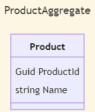

Aggregates are a design pattern that play a big role in domain-driven development. In many systems, the relationships between [entities](./entity) can become so interwoven that attempting to eager-load an entity and all of its related entities from persistence results in attempting to download the entire database. A common approach to mitigate this issue is to turn on lazy-loading, but this is frequently more of a band-aid than an elegant solution, and brings with it its own problems.

An **aggregate** is a collection of one or more related entities (and possibly [value objects](./value-object)). Each aggregate has a single root entity, referred to as the **aggregate root**. The aggregate root is responsible for controlling access to all of the members of its aggregate. It's perfectly acceptable to have single-entity aggregates, in which case that entity is itself the root of its aggregate. In addition to controlling access, the aggregate root is also responsible for ensuring the consistency of the aggregate. This is why it is important to ensure that the aggregate root does not directly expose its children, but rather controls access itself.

When applying the aggregate pattern, it is also important that persistence operations apply only at the aggregate root level. Thus, the aggregate root must be an entity, not a value object, so that it can be persisted to and from a data store using its identifier. This is important, since it means the aggregate root can be certain that other parts of the system are not fetching its children, modifying them, and saving them without its knowledge. It also can simplify the relationships between entities, since typically navigation properties should only exist for types within aggregates, while other relationships should be by key only.

When considering how to structure your entities into aggregates, a useful rule of thumb is to consider whether deletes should cascade. Deleting an aggregate root should typically delete all of its children as well. If you find that, when deleting the root, it would not make sense to delete some or all of the children, then you may need to reconsider your choice of aggregate root (or aggregate).

## eCommerce example of aggregates

As an example, consider an eCommerce domain which has concepts for Orders (`Order`), which have multiple order items (`OrderItem`), each of which refers to some quantity of products (`Product`) being purchased. Adding and removing items to an Order should be controlled by the `Order` - parts of the application shouldn't be able to reach out and create an individual `OrderItem` as part of an `Order` without going through the `Order`. Deleting an `Order` should delete all of the order items that are associated with it. So, `Order` makes sense as an aggregate root for the `Order` - `OrderItem` group.

<!--  -->

```mermaid
---
title: OrderAggregate
---
classDiagram
  Order <|-- OrderItem
class OrderItem {
    int Id
    int Quantity
    Guid ProductId
    string Name
}
class Order {
    int Id
    List~OrderItem~ LineItems
    ... 
    AddItem()
    RemoveItem()
    UpdateItem()
}
```

In this example, the `Order` aggregate is composed of multiple entities. However, access to the `OrderItem` entity is managed by the `Order` aggregate.

What about `Product`? Each `OrderItem` represents (among other things) a quantity of a product. Does it make sense for `OrderItem` to have a navigation property for `Product`? If so, that would complicate the `Order` aggregate, since ideally it should be able to traverse all of its navigation properties when persisting. As a test, does it make sense to delete "Product A" if an order for that product is deleted? No, while this order may not include "Product A", another order may include it. Thus, `Product` doesn't belong within the `Order` aggregate. It's likely that `Product` should be its own aggregate root, in which case fetching product instances can be done using a [Repository](/design-patterns/repository-pattern/). All that's required to do so is its `Id`. Thus, if `OrderItem` only refers to `Product` by `Id`, that's sufficient.

<!--  -->

In this example, the Product aggregate does not have any other entities. This is an example of a single-entity aggregate.

```mermaid
---
title: ProductAggregate
---
classDiagram
  
class Product {
    Guid ProductId
    string Name
}
```

A common concern at this point, though, is performance. If `OrderItem` doesn't have a navigation property for the product associated with it, how will the name of the product be displayed in the user interface for displaying an Order? In this case, this is the wrong question to ask. The better question is, if an `Order` is placed for product 123 named "Widget A" and at some point in the future this product is renamed to "Widget B", what should be displayed when this order is reviewed? Most likely, since the customer probably received a notification with details of their order that listed "Widget A" (and probably didn't list its `Id` at all), it will cause confusion if the system now retroactively says they ordered "Widget B". Thus, the `OrderItem`, when created, should probably include some details of the Product, such as its name. This will necessarily introduce some duplication into the system, but the historic record of what the customer purchased should not be tightly coupled to the current name of the product, at least in this scenario. As a side benefit, displaying the order and its order items is very fast, since the necessary data is all within this aggregate.

## References

[Domain-Driven Design Fundamentals](https://www.pluralsight.com/courses/domain-driven-design-fundamentals) Pluralsight

[Effective Aggregate Design](https://www.dddcommunity.org/library/vernon_2011/) - Vaughn Vernon
