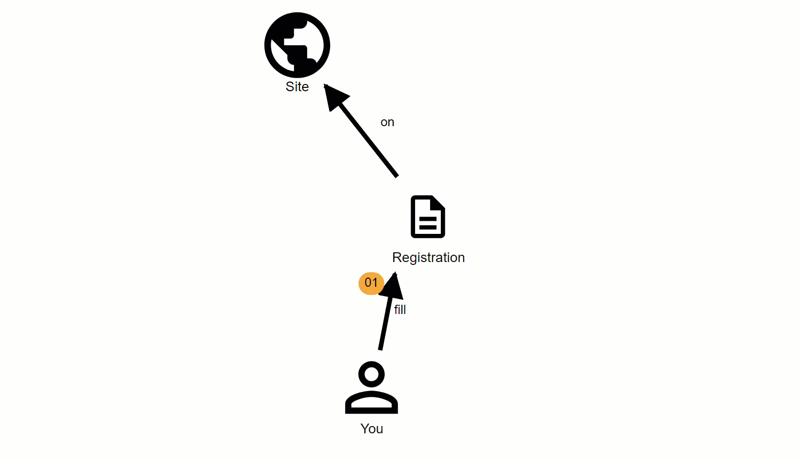

Communication is important in [DDD](./ddd-overview), especially in developing [ubiquitous language](./ubiquitous-language). It allows domain experts to tell the stories, capture the workflows, and illustrate those stories.

The stories of the domains are illustrated with iconography and arrows, with labels to identify the actors and their relationships with the work objects.

While talking through the various scenarios, the following goals are achieved:

- [Ubiquitous language](./ubiquitous-language) develops.
- [Bounded contexts](./bounded-context) may be identified.
- Requirements and scope may be established.

The sample below talks through the process you go through when you sign up for a domain storytelling (or any other topic) webinar through [NimblePros](https://nimblepros.com).

1. You register on a website.
2. The website tags you as someone interested in domain storytelling (or *topic*).
3. The website sends you the meeting info.
4. You join the online meeting with other attendees.
5. The website will send you a "thank you email" with links related to the webinar, including the webinar recording.
6. You watch the recording afterwards to get those morsels of knowledge.

Domain storytelling is a powerful technique in domain-driven design that enables the understanding and modeling of complex business domains. It involves engaging domain experts and stakeholders in creating narratives about how different domain elements interact to achieve business objectives. This narrative-driven approach allows for a deeper understanding of the underlying processes, relationships, and rules governing the domain, hence helping to design software that mirrors and supports the real-world intricacies of the business.

The use of visual maps or storyboards, with symbols representing actors and arrows indicating actions or events, adds clarity to these narratives. Domain storytelling assists with [context mapping](./context-mapping), serving as a bridge and helping to translate the language and complex concepts of the business domain into a shared model for the design of software. This shared understanding improves alignment between business needs and software design, ultimately leading to more effective and value-adding software solutions.

## Domain Storytelling resources

- Learn more at [DomainStorytelling.org](https://domainstorytelling.org/)
- Draw your domain stories using [Egon.io](https://egon.io)
