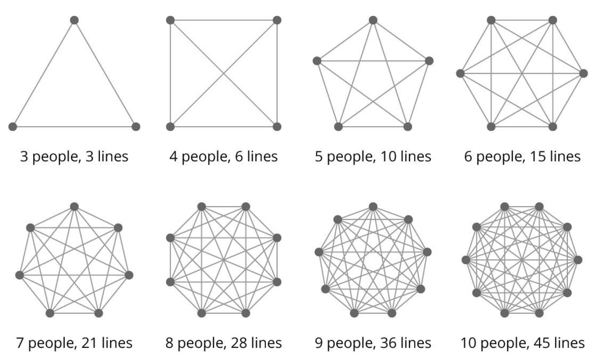

*“Adding manpower to a late software project makes it later.”* - Fred Brooks

In this quick guide, we'll explore Brooks's Law, a principle formulated by computer scientist Fred Brooks that has had a significant impact on software development and project management.

## Table of Contents

- [Table of Contents](#table-of-contents)
- [What is Brooks's Law?](#what-is-brookss-law)
- [The Mythical Man-Month](#the-mythical-man-month)
- [Brooks's Law in Action](#brookss-law-in-action)
- [Strategies to Mitigate Brooks's Law](#strategies-to-mitigate-brookss-law)
- [Further Reading](#further-reading)

## What is Brooks's Law?

Brooks's Law states that adding more personnel to a late software project can actually make it even later. This counterintuitive idea has implications for project management, as it suggests that simply increasing the number of developers may not always lead to faster completion.

## The Mythical Man-Month

Fred Brooks introduced Brooks's Law in his seminal 1975 book, "[The Mythical Man-Month](https://en.wikipedia.org/wiki/The_Mythical_Man-Month)". The book offers insights into software engineering and project management, and remains influential to this day.

The "man-month" refers to the concept of calculating a project's duration by multiplying the number of people working on it by the number of months it takes to complete. Brooks argues that this simplistic approach fails to account for factors such as communication overhead and the time it takes for new team members to get up to speed.

## Brooks's Law in Action

The negative impact of adding more personnel to a late project can be attributed to several factors:

1. **Ramp-up time**: New team members require time to familiarize themselves with the project, during which their productivity is lower.
2. **Increased communication overhead**: As the team grows, communication becomes more complex, and the time spent on coordination increases.
3. **Task fragmentation**: Adding more developers can lead to tasks being broken into smaller pieces, which may not always result in increased efficiency.

This image provides a visual representation of the lines of communication required in team sizes greater than 2:

Clearly the communication overhead increases dramatically as team size increases, reducing the time available for other tasks, like programming. This is one reason why team sizes should be limited. However, once an organization grows large enough that they need multiple teams, [Conway's Law](./conways-law) begins to come into play.

## Strategies to Mitigate Brooks's Law

To address the challenges posed by Brooks's Law, consider the following strategies:

1. **Invest in planning and design**: Thorough planning and design at the outset can help prevent projects from running late in the first place.
2. **Leverage modular design**: Creating modular software components can reduce dependencies, making it easier to add new developers without increasing communication overhead.
3. **Improve team communication**: Efficient communication tools and practices can help minimize the impact of growing team size on project deadlines.

## Further Reading

1. [The Mythical Man-Month (Book) - Wikipedia](https://en.wikipedia.org/wiki/The_Mythical_Man-Month)
2. [Fred Brooks - Wikipedia](https://en.wikipedia.org/wiki/Fred_Brooks)
3. [Strategies for Managing Large Software Projects - CIO](https://www.cio.com/article/2412871/strategies-for-managing-large-software-projects.html)
4. [Modular Design in Software Engineering - GeeksforGeeks](https://www.geeksforgeeks.org/modular-design-in-software-engineering/)
5. [Effective Communication in Software Development Teams - Atlassian](https://www.atlassian.com/blog/teams)
