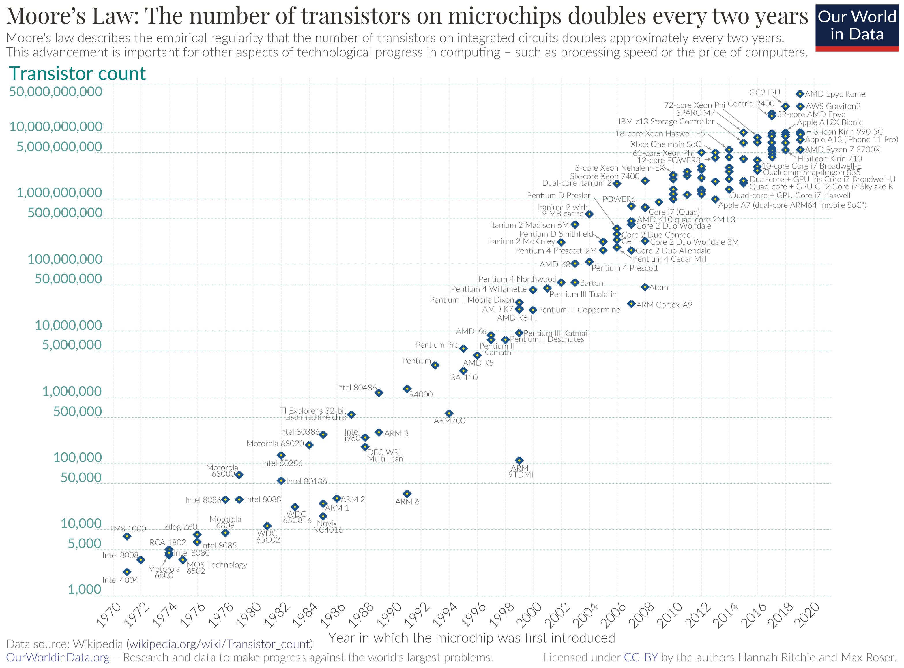

Moore's Law is a fundamental observation in the field of computing that has driven technological progress for over half a century. Formulated by Gordon Moore, co-founder of Intel, Moore's Law posits that **the number of transistors on a microchip doubles approximately every two years, effectively doubling processing power while reducing relative costs**. This exponential growth has had a profound impact on hardware, and by extension, has significantly influenced software development practices, architectures, and paradigms.

## Understanding Moore's Law

In a 1965 paper, Gordon Moore predicted that as manufacturing processes and materials advanced, the density of transistors on integrated circuits would increase exponentially. Although Moore's Law is not a physical or scientific law, it accurately predicted the trend of increasing computational power for decades. However, as technology approaches atomic scales, maintaining this exponential pace is becoming increasingly challenging. Nonetheless, Moore’s Law has shaped expectations for hardware capability growth and the scaling of software applications.

Source: *https://upload.wikimedia.org/wikipedia/commons/0/00/Moore%27s_Law_Transistor_Count_1970-2020.png*

## The Impact of Moore's Law on Software Development

The evolution predicted by Moore’s Law has had several impacts on software development, including the following:

### 1. Increased Computational Power

With each generation of microprocessors becoming faster and more powerful, software applications have been able to incorporate more complex features and algorithms. This increase in power allowed for the rise of applications in artificial intelligence, machine learning, data analytics, and graphics processing, which were previously impossible or impractical due to hardware limitations.

**Example:** Machine learning and AI applications benefit directly from increased processing power, enabling the real-time processing and training of complex models that would have been prohibitively slow or resource-intensive on older hardware.

### 2. Shift Toward Parallel and Distributed Computing

As individual processors approached the physical limits of Moore's Law, software development began leveraging multi-core architectures and distributed computing. This shift required developers to focus on parallelism and concurrency, impacting language design, libraries, and frameworks optimized for multi-threaded processing.

**Example:** Frameworks like .NET's Task Parallel Library and Java's ForkJoin framework reflect the shift towards parallel computing, helping developers optimize applications for modern multi-core systems.

### 3. Shorter Development and Product Life Cycles

With rapid advancements in processing power and associated technologies, software development cycles have become shorter to meet the demands for faster, more feature-rich applications. This trend has encouraged iterative methodologies such as Agile and DevOps, which allow for quick adaptation to changing hardware capabilities.

**Example:** The evolution of cloud-based services and continuous deployment pipelines enables rapid software iteration to keep up with hardware advancements, a response partly driven by Moore’s Law.

### 4. Increased Focus on Optimization and Efficiency

While Moore’s Law encouraged software to push the boundaries of hardware, the end of this trend has led to a renewed focus on code efficiency. With hardware no longer guaranteed to double in speed every two years, developers increasingly prioritize performance optimizations, algorithm efficiency, and reducing computational overhead.

**Example:** Low-level optimizations, such as those seen in performance-sensitive applications (e.g., video games or real-time simulations), are critical in making the most of available hardware, especially as processor speed growth slows.

### 5. Hardware-Agnostic Development and Virtualization

The rise of virtualization and cloud computing has lessened direct dependence on individual hardware capabilities, allowing software to be deployed across various platforms. This change has influenced software architecture, fostering the adoption of containerization and platform-independent development.

**Example:** Platforms like Docker and Kubernetes allow applications to run in isolated environments, abstracting away specific hardware configurations and enabling flexible, scalable deployments.

## The Future of Moore's Law and Software Development

Although physical limitations are causing Moore's Law to slow, alternatives like quantum computing, [neuromorphic processors](https://en.wikipedia.org/wiki/Neuromorphic_computing), and specialized hardware (e.g., GPUs and TPUs) promise continued advances in computational power. These new technologies may shift software development practices, particularly for specialized applications like artificial intelligence, which are already leveraging custom hardware.

As Moore's Law fades, software development will likely focus more on architectural efficiency, algorithmic complexity, and parallelism, ensuring that applications continue to scale effectively even as hardware improvements slow.

## Conclusion

Moore's Law has profoundly shaped software development by consistently increasing available computational power. From fostering parallel and distributed computing paradigms to influencing agile development practices, its legacy is deeply embedded in modern software engineering. As technology evolves beyond traditional transistor-based processors, software development will need to adapt to a new era of specialized hardware and efficiency-driven practices.

## References

1. Moore, G. E. "Cramming more components onto integrated circuits." *Electronics*, vol. 38, no. 8, 1965.
2. [Wirth's Law](wirths-law)
