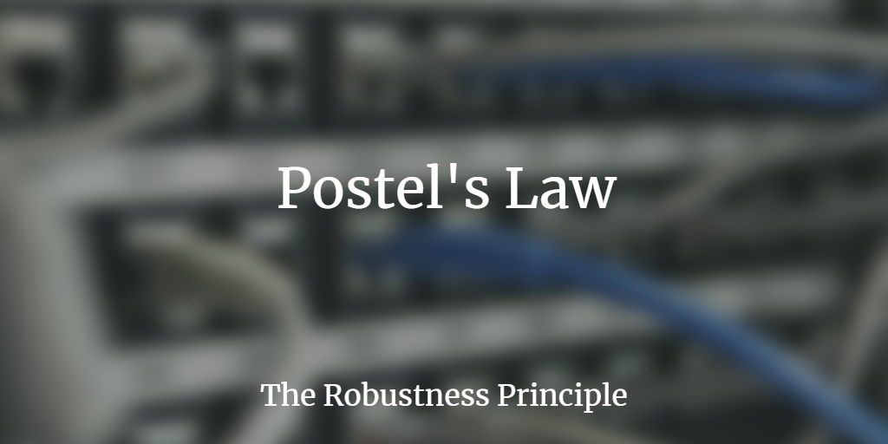

Postel's Law (also known as the Robustness Principle) states: "Be liberal in what you accept, and conservative in what you send."

This principle is named for Jon Postel, who wrote it in an early specification of the Transmission Control Protocol, TCP (of TCP/IP fame).

In programming, Postel's Law relates to [covariance and contravariance](https://en.wikipedia.org/wiki/Covariance_and_contravariance_(computer_science)). Functions and APIs may be contravariant with respect to their inputs, but covariant with respect to their outputs.

In all of these cases, the intent is to minimize system failures. By accepting a variety of formats of inputs, a function or system is better able to deal with a variety of collaborating systems calling it. Likewise, by being consistent with its outputs, the system is less likely to break disparate systems that call it because the output won't surprise the caller (see also the [Principle of Least Astonishment](https://en.wikipedia.org/wiki/Principle_of_least_astonishment)).

## A simple example given an API endpoint.

Imagine an API endpoint that creates new resources, such a Products. Adding a resource might involve a POST to a route like `/products`, with the details in the body of the POST. Imagine this is an older endpoint, and some of its clients send data to it in XML format. Newer clients send data using JSON. Future clients might use another format. By accepting a variety of serialization formats for the incoming data, the endpoint is being liberal - or flexible - in what it accepts. It might also be the case that newer versions of the API allow additional fields to be sent describing the new Product, but these added fields are optional, so POSTs that do not include them continue to work as well.

What should the endpoint return?

- It could simply return 200 OK
- It could return a 201 Created response
- It could include the newly created resource (with its newly specified ID)
- It could return a Location header with the URI of the newly created resource
- If it fails, it could return a 400 Bad Request, a 500 Server Error, or even a 200 OK (don't do this)

Of course the endpoint probably isn't alone - there are probably other endpoints that make up the total API, and they all follow certain conventions for their returned results as well.

Postel's Law suggests that for a given scenario, the response from an endpoint in the API should be extremely predictable. In other words, the API should be consistent. If successful POSTs return OK with the newly created resource in the response body, then that's how every such POST should work. If response formatting (XML, JSON, etc.) can be specified by the client (via an Accept header), then this too should work consistently across the set of endpoints in the API. Postel's Law doesn't mean that a given endpoint should always return one particular response, but it suggests that there should be consistency in how endpoints behave in response to common inputs and scenarios.

In addition to API requests and responses, Postel's Law should also be applied to messaging contracts (commands, events, etc.).

## References

[Postel's Law - The Robustness Principle](https://ardalis.com/postels-law-robustness-principle/)
[ASP.NET Core Web API: Best Practices](https://www.pluralsight.com/courses/aspdotnet-core-6-web-api-best-practices)
[Postel's Law](https://lawsofux.com/postels-law/)
[The Robustness Principle](https://en.wikipedia.org/wiki/Robustness_principle)
